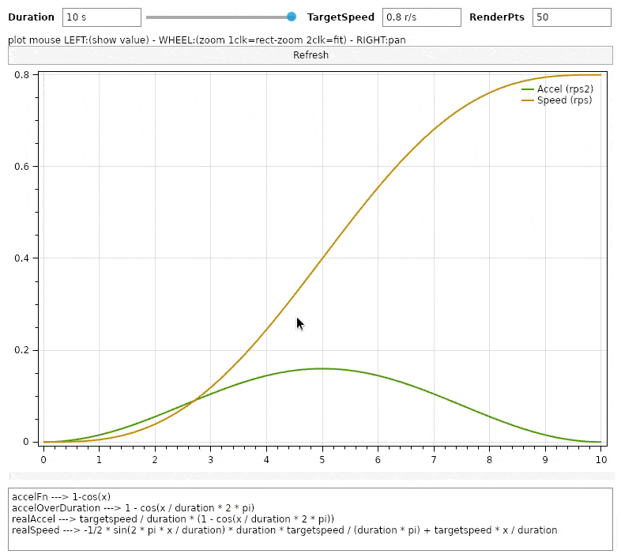
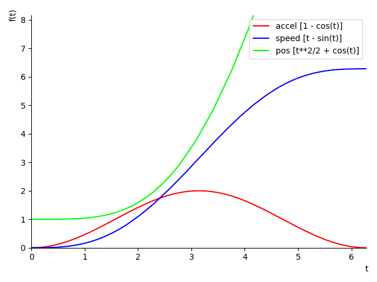

# scurve speed eval

Show how s-curve speed type can be obtained.



references:
- [How to get sinusoidal s-curve for a stepper motor](http://fightpc.blogspot.com/2018/04/how-to-get-sinusoidal-s-curve-for.html)

## Description

This app is not intended to produce scurve speed in realtime for constrained devices for those an approach is already explained in the article cited in references above, but wants to explain how much acceleration is required to reach a target speed in a given time using a s-curve speed profile.

I used the wonderful [AngouriMath](https://github.com/asc-community/AngouriMath) library to execute calculus in the code to demostrate the process described following, but final formula can be used of course.

- from the fn [1-cos(x)][1] that will produce follow for x=0..2pi



where its integral ( the speed ) reach 2pi for x=2pi

- [accelOverDuration][2] was computed to make the accel function applicable to the `[0..duration]` domain instead of the original `[0..2pi]`

<!-- $$
\Large
accelOverDuration=1-\cos\left(\frac{x}{duration}\cdot 2\cdot \pi\right)
$$ --> 

<br/>
<div align="center"></div>
<br/>

- accelOverDuration integral produce a speed that we need to scale in order to fit with required targetspeed; [a factor][3] is computed to obtain *realAccel*:

<!-- $$
\Large
realAccel = \frac{targetspeed}{\int_0^{duration} accelOverDuration}\cdot accelOverDuration
$$ --> 

<div align="center"></div> 

<!-- $$
\Large
realAccel=\frac{targetspeed}{duration}\cdot \left(1-\cos\left(\frac{x}{duration}\cdot 2\cdot \pi\right)\right)
$$ --> 

<br/>
<div align="center"></div>
<br/>

having accel a shape where the max accel is at x=duration/2 the above can simplified as

<!-- $$
\Large
maxRealAccel=\frac{targetspeed}{duration}\times2
$$ --> 

<br/>
<div align="center"></div>
<br/>

*example*: targetspeed=0.8r/s ; duration=0.5s ; maxRealAccel=3.2r/s2

- The *realSpeed* results as the [integral of realAccel][4]:

<!-- $$
\Large
realSpeed=\frac{\frac{-1}{2}\cdot \sin\left(\frac{2\cdot \pi\cdot x}{duration}\right)\cdot targetspeed}{\pi}+\frac{targetspeed\cdot x}{duration}
$$ --> 

<br/>
<div align="center"></div>
<br/>

- position from time `x`

<!-- $$
\Large
pos = \frac{\cos\left(\frac{2\cdot \pi\cdot x}{duration}\right)\cdot {duration}\cdot targetspeed}{4\cdot {\pi}^{2}}+\frac{targetspeed\cdot {x}^{2}}{2\cdot duration}
$$ --> 

<div align="center"></div>

- targetSpeed required from known distance to cover `pos` in given `duration` time

<!-- $$
\Large
targetspeed=\frac{4 \cdot \pi^{2} \cdot pos}{duration \cdot (1+2 \pi)}
$$ --> 

<div align="center"></div>


[1]: https://github.com/devel0/scurve-speed-eval/blob/0bff63605a3f7fae49d6f56aab4b813efa755242/Program.cs#L48

[2]: https://github.com/devel0/scurve-speed-eval/blob/0bff63605a3f7fae49d6f56aab4b813efa755242/Program.cs#L51

[3]: https://github.com/devel0/scurve-speed-eval/blob/0bff63605a3f7fae49d6f56aab4b813efa755242/Program.cs#L54

[4]: https://github.com/devel0/scurve-speed-eval/blob/0bff63605a3f7fae49d6f56aab4b813efa755242/Program.cs#L57

## Prerequisites

- [vscode](https://code.visualstudio.com/)
- [dotnet 5.0](https://dotnet.microsoft.com/download)

## Quickstart

```sh
git clone https://github.com/devel0/netcore-sci
git clone https://github.com/devel0/netcore-util
git clone https://github.com/devel0/scurve-speed-eval
cd scurve-speed-eval
dotnet run
```

## How this project was built

```sh
dotnet new console -n scurve-speed-eval
cd scurve-speed-eval
dotnet sln add scurve-speed-eval.csproj
dotnet sln add .
dotnet add reference ../netcore-util/netcore-util
dotnet add reference ../netcore-sci/netcore-sci
dotnet add package AngouriMath --version 1.2.0-preview.5
dotnet add package Avalonia.Desktop --version 0.10.0-preview6
dotnet add package OxyPlot.Avalonia --version 2.1.0-20200725.1
dotnet add package UnitsNet --version 4.76.0
dotnet run
```
