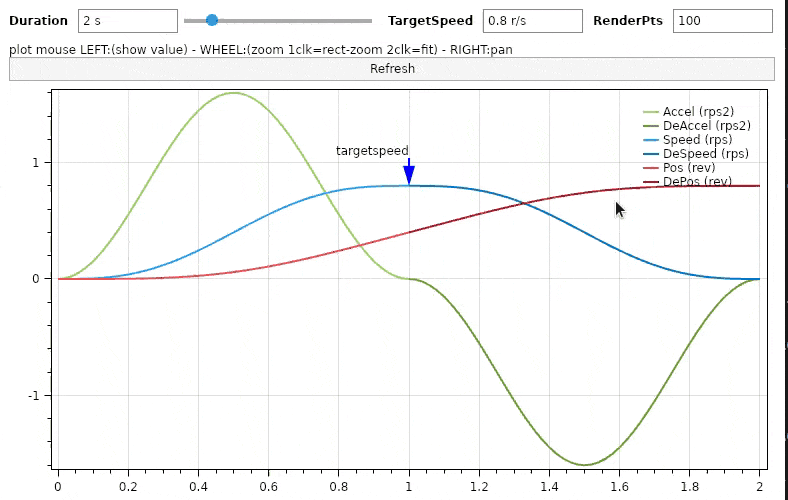

# scurve speed eval

Show how s-curve speed type can be obtained.



---

<!-- TOC -->
- [scurve speed eval](#scurve-speed-eval)
  * [Description](#description)
  * [Example](#example)
  * [Prerequisites](#prerequisites)
  * [Quickstart](#quickstart)
  * [How this project was built](#how-this-project-was-built)
  * [References](#references)
<!-- TOCEND -->

---

## Description

This app is not intended to produce scurve speed in realtime for constrained devices for those an approach is already explained in the article cited in references, but wants to explain formulas involved in computing accel, speed, pos for acceleration/deceleration phases for an s-curve shaped speed profile.

For symbolic calculus [AngouriMath](https://github.com/asc-community/AngouriMath) library was used.

For preliminary analysis [sympy](https://github.com/sympy/sympy) with [this](data/test.py) test was used.


- lets name
    - **t** (time)
    - **x** (distance) 
    - **d** (total duration accel/decel)
    - **s** (final speed)

- suppose `[0,d/2]` the time for acceleration while `[d/2,d]` the time for deceleration to produce a target final speed `s` starting from speed=0 and pos=0
- from base acceleration function [1-cos(t)][1]
- expanding the period domain from `[0,2pi]` to `[0,d/2]` through [this][2] subst
- [stretching][3] the accel function so that its integral, the speed, achieve targetspeed
- acceleration results as [this][4]

<!-- $$
\large
accel(t)=\frac{2\cdot s}{d}\cdot\left(1-\cos\left(\frac{4\cdot\pi\cdot t}{d}\right)\right)
$$ --> 

<div align="center"></div>

- positive max accel value is at midpoint ( t=1/4d because accel positive in `[0,d/2]` ) thus above can be simplified into

<!-- $$
\large
maxAccel=\frac{4\cdot s}{d}
$$ --> 

<div align="center"></div>

- [integration of accel][5] gives speed

<!-- $$
\large
speed(t) = \frac{2\cdot s}{d} \cdot \left( t - \frac{d\cdot \sin\left(\frac{4\cdot\pi\cdot t}{d}\right)}{4\cdot\pi} \right)
$$ --> 

<div align="center"></div>

- [integration of speed][6] gives pos ( normalized removing integration constant computed for t=0 )

<!-- $$
\large
pos(t) = \frac{s\cdot d \cdot \left( \cos\left(\frac{4\cdot\pi\cdot t}{d}\right)-1 \right)}{8\cdot\pi^2} + \frac{s\cdot t^2}{d}
$$ --> 

<div align="center"></div>

- [targetspeed][7] required from known final position `p` to reach in required time duration `d`

<!-- $$
\large
s = \frac{2\cdot p}{d}
$$ --> 

<div align="center"></div>

- from base deceleration function [cos(t)-1][8]

- deceleration results as [this][9]

<!-- $$
\large
deAccel\left(t+\frac{d}{2}\right) = \frac{2\cdot s}{d}\cdot\left(\cos\left(\frac{4\cdot\pi\cdot t}{d}\right)-1\right)
$$ --> 

<div align="center"></div>

- despeed results as [this][10] ( given from deAccel integral subtracting integration constant and adding speed achieved by accel at `d/2` )

<!-- $$
\large
deSpeed\left(t+\frac{d}{2}\right) = \frac{2\cdot s\cdot\sin\left(\frac{4\cdot\pi\cdot t}{d} \right)}{4\cdot\pi}-\frac{2\cdot s\cdot t}{d}+s
$$ --> 

<div align="center"></div>

- depos results as [this][11] ( given from deSpeed integral subtracting integration constant and adding pos achieved by accel at `d/2` )

<!-- $$
\large
dePos\left(t+\frac{d}{2}\right) = \frac{s\cdot d\cdot\left( 1-\cos\left(\frac{4\cdot\pi\cdot t}{d}\right) \right)}{8\cdot\pi^2}-\frac{s\cdot t^2}{d}+s\cdot t+\frac{s\cdot d}{4}
$$ --> 

<div align="center"></div>

[1]: https://github.com/devel0/scurve-speed-eval/blob/435327c86769302a22fa54fb6b349a60a1b640d1/gui%2FProgram.cs#L48
[2]: https://github.com/devel0/scurve-speed-eval/blob/435327c86769302a22fa54fb6b349a60a1b640d1/gui%2FProgram.cs#L49
[3]: https://github.com/devel0/scurve-speed-eval/blob/435327c86769302a22fa54fb6b349a60a1b640d1/gui%2FProgram.cs#L50
[4]: https://github.com/devel0/scurve-speed-eval/blob/435327c86769302a22fa54fb6b349a60a1b640d1/gui%2FProgram.cs#L51
[5]: https://github.com/devel0/scurve-speed-eval/blob/435327c86769302a22fa54fb6b349a60a1b640d1/gui%2FProgram.cs#L53
[6]: https://github.com/devel0/scurve-speed-eval/blob/435327c86769302a22fa54fb6b349a60a1b640d1/gui%2FProgram.cs#L57
[7]: https://github.com/devel0/scurve-speed-eval/blob/435327c86769302a22fa54fb6b349a60a1b640d1/gui%2FProgram.cs#L60
[8]: https://github.com/devel0/scurve-speed-eval/blob/435327c86769302a22fa54fb6b349a60a1b640d1/gui%2FProgram.cs#L62
[9]: https://github.com/devel0/scurve-speed-eval/blob/435327c86769302a22fa54fb6b349a60a1b640d1/gui%2FProgram.cs#L65
[10]: https://github.com/devel0/scurve-speed-eval/blob/435327c86769302a22fa54fb6b349a60a1b640d1/gui%2FProgram.cs#L69
[11]: https://github.com/devel0/scurve-speed-eval/blob/435327c86769302a22fa54fb6b349a60a1b640d1/gui%2FProgram.cs#L72

## Example


This [example](examples/scurve-xlsx/Program.cs) can be executed through

```
dotnet run --project examples/scurve-xlsx
```

and it will produce follow [output.xlsx](examples/scurve-xlsx/output.xlsx) by applying above formulas and doing some test calc about max allowable torque based on motion and supposed load.

## Prerequisites

- [vscode](https://code.visualstudio.com/)
- [dotnet 5.0](https://dotnet.microsoft.com/download)

## Quickstart

```sh
git clone https://github.com/devel0/netcore-sci
git clone https://github.com/devel0/netcore-util
git clone https://github.com/devel0/scurve-speed-eval
cd scurve-speed-eval
dotnet build
dotnet run --project gui
```

## How this project was built

```sh
dotnet new console -n scurve-speed-eval
cd scurve-speed-eval
dotnet sln add scurve-speed-eval.csproj
dotnet sln add .
dotnet add reference ../netcore-util/netcore-util
dotnet add reference ../netcore-sci/netcore-sci
dotnet add package AngouriMath --version 1.2.0-preview.5
dotnet add package Avalonia.Desktop --version 0.10.0-preview6
dotnet add package OxyPlot.Avalonia --version 2.1.0-20200725.1
dotnet add package UnitsNet --version 4.76.0
dotnet run
```

## References

- [How to get sinusoidal s-curve for a stepper motor](http://fightpc.blogspot.com/2018/04/how-to-get-sinusoidal-s-curve-for.html)
