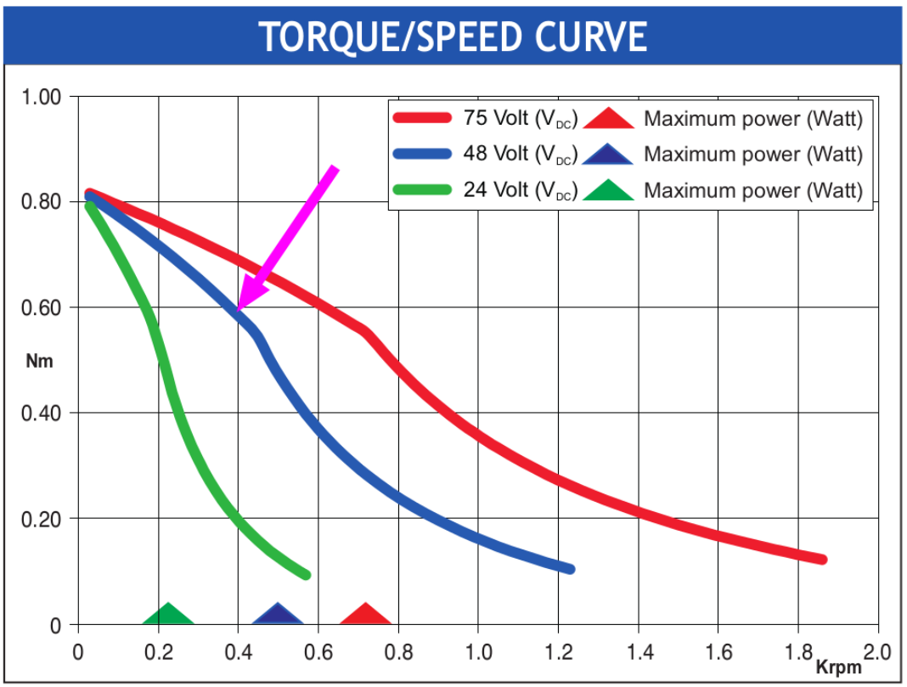
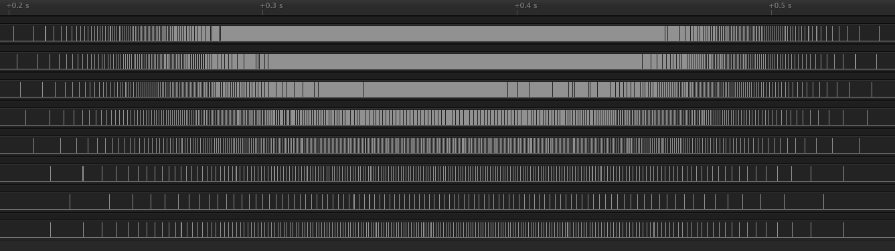

# scurve-stepper

<!-- TOC -->
- [scurve-stepper](#scurve-stepper)
  * [Description](#description)
  * [Quickstart](#quickstart)
  * [Load sizing](#load-sizing)
  * [Examples](#examples)
    + [example01](#example01)
    + [example02](#example02)
    + [wirings](#wirings)
      - [nucleo-64 **stm32-f446re**](#nucleo-64-stm32-f446re)
      - [nucleo-144 **stm32-f767zi**](#nucleo-144-stm32-f767zi)
  * [Debugging](#debugging)
  * [How this project was built](#how-this-project-was-built)
  * [Future works](#future-works)
<!-- TOCEND -->

## Description

Library to control stepper motor [scurve impulse](https://github.com/devel0/scurve-speed-eval) type motion for ststm32 platform, mbed os framework.

Keynotes:
- a [move](https://github.com/devel0/scurve-speed-eval/blob/7be5916fd4e6440ba6acc80f9a8664b1fb84717d/scurve-impulse-stepper%2Fsrc%2Fscurve-impulse-stepper.cpp#L25) method allow to setup motion
- a [control](https://github.com/devel0/scurve-speed-eval/blob/7be5916fd4e6440ba6acc80f9a8664b1fb84717d/scurve-impulse-stepper%2Fsrc%2Fscurve-impulse-stepper.cpp#L57) method is required to be called in a loop
- a [pulse_down](https://github.com/devel0/scurve-speed-eval/blob/7be5916fd4e6440ba6acc80f9a8664b1fb84717d/scurve-impulse-stepper%2Fsrc%2Fscurve-impulse-stepper.cpp#L120) timeout provides bring signal level to 0 after pulse_width expired
- a [common timer](https://github.com/devel0/scurve-speed-eval/blob/7be5916fd4e6440ba6acc80f9a8664b1fb84717d/scurve-impulse-stepper%2Fexamples%2Fexample01.cpp#L30) is used to drive N motors

## Quickstart

Install using vscode command palette `PlatformIO: New Terminal` referring to [platformio registry](https://platformio.org/lib/show/11589/scurve-impulse-stepper) cli mode doc.

If got trouble during compile, remove `.pio/libdeps/nucleo_f446re/scurve-impulse-stepper/library.json`.

## Load sizing

This scurve impulse stepper library can be of help if you have to control specific periodic motions like those for controlling actuators in industrial automation where you know the time (motion duration) for which a position (revolution) must granted.

Of course you have to choose right motor and load transmission mechanism.

Todo that you need the torque/speed curve from motor datasheet, then knowing the targetspeed (s=2p/d), force applied (F) and lever arm length (l) you will know how much max torque required and comparing with the diagram know allowableTorque that can applied without that the motor exit its safe region to ensure motion without lost of pulse or motor blocking.
A safety factor sf=allowableTorque/requiredTorque >= 1 ( suggested 5 or 10 ) is an indicator that need to be reported in a project design to describe the level of safetiness in load sizing.

Acceleration max using impulse motion results from amax=4s/d then torque=Fl ; now, watching at datasheet torque curve you can find that in some cases use of load transmission mechanism such as gearbox can lead to better results.

For example, follow [nema17 torque curve](https://www.rta.it/uploads/103-H7123-0440.pdf) @48V where:
- 0.2krpm~=3.3rps max torque is 0.7Nm~=7kgcm
- 0.4krpm~=6.7rps max torque is 0.6Nm~=6kgcm
- 0.8krpm~=13.4rps max torque is 0.22Nm~=2.2kgcm



- case1 : transmitted target speed supposed 3.3rps~=0.2krpm
    - without transmission gear (ts=3.3rps~=0.2krpm) : maxTorque~=7kgcm
    - with transmission gear 1:2 (ts=6.7rps~=0.4krpm) : maxTorque=2*6kgcm=12kgcm
- case2 : transmitted target speed supposed 6.7rps~=0.4krpm
    - without transmission gear (ts=6.7rps~=0.4krpm) : maxTorque~=6kgcm
    - with transmission gear 1:2 (ts=13.4rps~=0.8krpm) : maxTorque=2*2.2kgcm=4.4kgcm

The above cases shows that in some situation the use of transmission mechanism increase effective torque ( case1 ) while decrease for others ( case2 ) because of the torque/speed curve shape.

## Examples

to run example choose which on by uncomment in examples/example.h then C-s-p `PlatformIO: Upload` and watch output at `PlatformIO: Serial Monitor`.

### example01

This example generate a scurve impulse (accel/decel) of total duration 390ms with waiting of 2s generating an impulse of 1.5revolutions issueing an expected target speed of

<!-- $$
\large
s=\frac{2\cdot p}{d}=\frac{2\cdot 1.2 rev}{0.39 s}=6.2\frac{rev}{s}
$$ --> 

<div align="center"></div>

```cpp
#include <mbed.h>

#include <scurve-impulse-stepper.h>
#include <timer-utils.h>
#include <slist.h>
#include <sstream>

DigitalOut mPort(M1_PIN);

int main()
{
    auto wait_time = 2000ms;
    auto motion_time = 390ms;
    auto pulse_rev = 400;
    auto pulse_width = 5us;
    auto rev_cnt = 1.5;

    //---

    Timer timer;    

    SCurveImpulseStepper m(1, timer, mPort, pulse_rev, pulse_width);

    timer.start();

    bool nfoReported = false;

    while (true)
    {
        auto t_now = timer.elapsed_time();

        auto m_state = m.state();

        if (m_state == SCurveStepperMotorState::idle && t_now - m.motionEnd() > wait_time ||
            m_state == SCurveStepperMotorState::unknown)
        {
            m.move(rev_cnt, motion_time);
        }

        if (m_state == SCurveStepperMotorState::moving)
        {
            nfoReported = false;
        }

        if (m_state == SCurveStepperMotorState::idle && !nfoReported)
        {
            m.debugStats();

            nfoReported = true;
        }

        m.control();        
    }
}
```

output:

```
m[1] pulse_executed: 600   pulse_expected: 600   motion_dur: 390ms   period_min: 308us
```

Logic analyzer:


### example02

This example drive 10 motors at same time of 390ms with waiting of 2s generating an impulses from 0.125rev to 3rev issueing target speed for the 3rev case of

<!-- $$
\large
s=\frac{2\cdot p}{d}=\frac{2\cdot 3 rev}{0.39 s}=15.4\frac{rev}{s}
$$ --> 

<div align="center"></div>

```cpp
#include <mbed.h>

#include <scurve-impulse-stepper.h>
#include <timer-utils.h>
#include <slist.h>
#include <sstream>

PinName m_pins[] = {M1_PIN, M2_PIN, M3_PIN, M4_PIN, M5_PIN, M6_PIN, M7_PIN, M8_PIN, M9_PIN, M10_PIN};
double m_rev_cnt[] = {3, 2.5, 2, 1.5, 1, 0.5, 0.25, 0.5, 3, 1};

int main()
{
    auto wait_time = 2000ms;
    auto motion_time = 390ms;
    auto pulse_rev = 400;
    auto screen_debug = true;
    auto pulse_width = 5us;

    //---

    Timer timer;

    SList<SCurveImpulseStepper *> motors;

    int motors_count = sizeof(m_pins) / sizeof(PinName);
    for (int i = 0; i < motors_count; ++i)
    {
        auto port = new DigitalOut(m_pins[i]);
        auto tag = i + 1;
        motors.Add(new SCurveImpulseStepper(tag, timer, *port, pulse_rev, pulse_width));
    }

    timer.start();

    bool nfoReported = false;

    auto firstMotorNode = motors.GetNode(0);

    while (true)
    {
        auto t_now = timer.elapsed_time();

        bool allIdle = true;

        auto n = firstMotorNode;
        int mi = 0;
        while (n != NULL)
        {
            SCurveImpulseStepper &m = *(n->data);
            auto m_state = m.state();

            if (m_state == SCurveStepperMotorState::idle && t_now - m.motionEnd() > wait_time ||
                m_state == SCurveStepperMotorState::unknown)
            {
                if (m_state == SCurveStepperMotorState::unknown)
                    allIdle = false;
                m.move(m_rev_cnt[mi], motion_time);
            }

            if (m_state == SCurveStepperMotorState::moving)
            {
                nfoReported = false;
                allIdle = false;
            }
            n = n->next;
            ++mi;
        }

        if (allIdle && !nfoReported)
        {
            int mnr = 1;
            n = firstMotorNode;
            while (n != NULL)
            {
                SCurveImpulseStepper &m = *(n->data);
                m.debugStats();

                mnr++;
                n = n->next;
            }
            nfoReported = true;
        }

        n = firstMotorNode;
        while (n != NULL)
        {
            n->data->control();
            n = n->next;
        }
    }
}
```

output:

```
m[1] pulse_executed: 1200   pulse_expected: 1200   motion_dur: 390ms   period_min: 82us
m[2] pulse_executed: 1000   pulse_expected: 1000   motion_dur: 390ms   period_min: 101us
m[3] pulse_executed: 800   pulse_expected: 800   motion_dur: 390ms   period_min: 152us
m[4] pulse_executed: 600   pulse_expected: 600   motion_dur: 390ms   period_min: 234us
m[5] pulse_executed: 400   pulse_expected: 400   motion_dur: 390ms   period_min: 412us
m[6] pulse_executed: 200   pulse_expected: 200   motion_dur: 390ms   period_min: 919us
m[7] pulse_executed: 100   pulse_expected: 100   motion_dur: 390ms   period_min: 1895us
m[8] pulse_executed: 200   pulse_expected: 200   motion_dur: 390ms   period_min: 928us
m[9] pulse_executed: 1200   pulse_expected: 1200   motion_dur: 390ms   period_min: 82us
m[10] pulse_executed: 400   pulse_expected: 400   motion_dur: 390ms   period_min: 408us
```

Logic analyzer first 8 motors:



### wirings

#### nucleo-64 **stm32-f446re**
```
                      _____                                  _____
           (M1) PC10 | · · | PC11 (M3)             (M5) PC9 | · · | PC8 (M7)
           (M2) PC12 | · · | PD2  (M4)             (M6) PB8 | · · | PC6 (M8)
                 VDD | · · | E5V                   (M9) PB9 | · · | PC5 (M10)
               BOOT0 | · · | GND                       AVDD | · · | U5V
                  NC | · · | NC                         GND | · · | NC
                  NC | · · | IOREF                "led" PA5 | · · | PA12
                PA13 | · · | RESET                      PA6 | · · | PA11
                PA14 | · · | +3V3                       PA7 | · · | PB12
                PA15 | · · | +5V                        PB6 | · · | NC
                 GND | · · | GND                        PC7 | · · | GND
                 PB7 | · · | GND                        PA9 | · · | PB2
                PC13 | · · | VIN                        PA8 | · · | PB1
                PC14 | · · | NC                        PB10 | · · | PB15
                PC15 | · · | PA0                        PB4 | · · | PB14
                 PH0 | · · | PA1                        PB5 | · · | PB13
                 PH1 | · · | PA4                        PB3 | · · | AGND
                VBAT | · · | PB0                       PA10 | · · | PC4
                 PC2 | · · | PC1                        PA2 | · · | NC
                 PC3 | · · | PC0                        PA3 | · · | NC
                      ￣CN7                                  ￣CN10
```

#### nucleo-144 **stm32-f767zi**

```
                                                   _CN7_
                                              PC6 | · · | PB8
                                             PB15 | · · | PB9
                                             PB13 | · · | AVDD
                  _CN8_                      PB12 | · · | GND
              NC | · · | PC8                 PA15 | · · | PA5
           IOREF | · · | PC9                  PC7 | · · | PA6
           RESET | · · | PC10                 PB5 | · · | PA7
           +3.3V | · · | PC11                 PB3 | · · | PD14
             +5V | · · | PC12                 PA4 | · · | PD15
             GND | · · | PD2                  PB4 | · · | PF12
             GND | · · | PG2                       ￣￣￣
             VIN | · · | PG3                                 
                  ￣￣￣                            _CN10
                                             AVDD | · · | PF13
                  _CN9_                      AGND | · · | PE9
             PA3 | · · | PD7                  GND | · · | PE11
             PC0 | · · | PD6                  PB1 | · · | PF14
             PC3 | · · | PD5                  PC2 | · · | PE13
             PF3 | · · | PD4                  PF4 | · · | PF15
             PF5 | · · | PD3                  PB6 | · · | PG14
            PF10 | · · | GND                  PB2 | · · | PG9
              NC | · · | PE2                  GND | · · | PE8
             PA7 | · · | PE4                 PD13 | · · | PE7
             PF2 | · · | PE5                 PD12 | · · | GND
        (M1) PF1 | · · | PE6 (M6)            PD11 | · · | PE10
        (M2) PF0 | · · | PE3 (M7)             PE2 | · · | PE12
             GND | · · | PF8 (M8)             GND | · · | PE14
        (M3) PD0 | · · | PF7 (M9)             PA0 | · · | PE15
        (M4) PD1 | · · | PF9 (M10)            PB0 | · · | PB10
        (M5) PG0 | · · | PG1                  PE0 | · · | PB11
                  ￣￣￣                           ￣￣￣￣
```

## Debugging

to debug examples/example01.cpp (included through [src/debug-main.cpp](src/debug-main.cpp)) it may needed to select only 1 platform from `platformio.ini` so the launch.json will generate accordingly; todo that comment others platform, ie:

```
[env]
src_filter = +<*> -<.git/> -<.svn/> -<example/> -<examples/> -<test/> -<tests/>

; [platformio]
; default_envs = nucleo_f446re, nucleo_f767zi

[env:nucleo_f767zi]
platform = ststm32
board = nucleo_f767zi
framework = mbed
test_build_project_src = true
debug_build_flags = -O0 -g -ggdb

; [env:nucleo_f446re]
; platform = ststm32
; board = nucleo_f446re
; framework = mbed
; test_build_project_src = true
; debug_build_flags = -O0 -g -ggdb
```

- [other references/troubleshoot](https://github.com/devel0/iot-stm32-ledblink-interrupt-debug#iot-stm32-ledblink-interrupt-debug)

## How this project was built

References:
- [Creating Library](https://docs.platformio.org/en/latest/librarymanager/creating.html?utm_medium=piohome&utm_source=platformio)
- [library.json](https://docs.platformio.org/en/latest/librarymanager/config.html)

## Future works

As evolution of [this project](https://github.com/devel0/scurve-speed-eval) will be a generic library to drive stepper motor using scurve velocity profile to allow various type of motion where you can constrain on speed, accel, position, duration.
